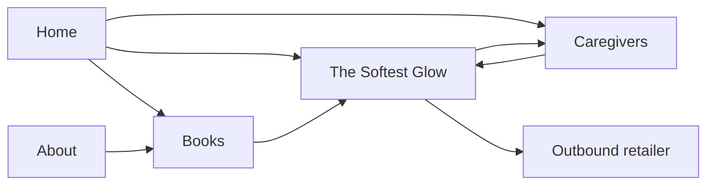

# Little Lanterns Website v1 — Information Architecture & Nav Spec

**Status:** Approved for build (LIT-68)  
**Audience:** Page builders (LIT-70–73), design system (LIT-69), hosting (LIT-75)  
**Domain:** `littlelanterns.*` (exact host set at deploy; paths below are host-relative)

---

## 1. Purpose

Give caregivers and gift-givers a calm, brand-true marketing site that:

1. Introduces the Little Lanterns picture-book line  
2. Showcases the debut title **The Softest Glow**  
3. Explains who we are  
4. Helps adults read aloud with confidence  

v1 is a small, shallow site — four primary pages, no account, no cart, no blog.

---

## 2. Sitemap (v1)

```
/                         Home
/books                    Books index (catalog)
/books/the-softest-glow   Debut title detail (Book 1)
/about                    About / Our Story
/caregivers               For Caregivers (read-aloud support)
/privacy                  Privacy (footer legal stub)
```

**Out of scope for v1:** shop/checkout, newsletter backend, blog, author login, multi-language, retailer deep checkout embeds.

**Retailer links:** Outbound only (Amazon/KDP product URL when the board provides it). Never login or publish from the site build.

---

## 3. URL scheme

| Rule | Spec |
|------|------|
| Style | Lowercase kebab-case; no trailing slash in canonicals |
| Nesting | Books only — `/books` + `/books/{slug}` |
| Slugs | Title-based; debut = `the-softest-glow` |
| Future titles | Add `/books/{slug}` without changing primary nav |
| Redirects | `/our-story` → `/about`; `/for-caregivers` → `/caregivers` |
| Anchors | Optional in-page: `/caregivers#tips`, `/books/the-softest-glow#look-inside` |
| Canonical host | Single apex (www → apex or reverse); decide in LIT-75 |

---

## 4. Page goals & primary content

### `/` — Home
| | |
|---|---|
| **Goal** | Make the brand memorable in one scroll; route visitors to the debut book or caregivers help. |
| **Hero job** | Brand name as hero-level signal + one line of promise + one primary CTA. |
| **Sections (order)** | 1) Hero 2) Debut book teaser (cover + short blurb) 3) Soft proof / who it’s for (ages 6–8) 4) Caregiver invite 5) Footer |
| **Primary CTA** | “Meet The Softest Glow” → `/books/the-softest-glow` |
| **Secondary CTA** | “Read-aloud tips” → `/caregivers` |
| **Avoid in first viewport** | Stats strips, schedule blocks, multi-card grids, floating badges |

### `/books` — Books
| | |
|---|---|
| **Goal** | Orient to the line; surface available titles (debut first). |
| **Content** | Intro line + title card(s). v1 may show one live title and optional “Coming next” placeholder (no fake ISBNs). |
| **CTA per title** | “View book” → detail page |

### `/books/the-softest-glow` — Title detail
| | |
|---|---|
| **Goal** | Convert interest: understand the story, see the cover, know how to get it / read it together. |
| **Sections** | Cover + title + age band; blurb; “Inside the book” (2–4 beat points); caregiver callout → `/caregivers`; get-the-book (outbound retailer when URL exists, else “Coming soon”); soft series context |
| **Primary CTA** | Get the book (retailer) **or** “Notify me / Coming soon” if no URL yet |
| **Secondary** | “Tips for reading aloud” → `/caregivers` |

### `/about` — About / Our Story
| | |
|---|---|
| **Goal** | Build trust: indie press making warm, high-quality picture books; care for child + caregiver. |
| **Tone** | Quiet, sincere — not corporate manifesto. |
| **Sections** | Why Little Lanterns; who we make books for; how we work (quality over volume); optional founder note if copy exists |
| **CTA** | “Explore the books” → `/books` |

### `/caregivers` — For Caregivers
| | |
|---|---|
| **Goal** | Practical read-aloud support tied to the debut title (and reusable for the line). |
| **Sections** | Why read-aloud matters (short); tips for *The Softest Glow*; general pacing / pause / questions tips; link back to title detail |
| **CTA** | “Open The Softest Glow” → `/books/the-softest-glow` |
| **Accessibility** | Clear headings, printable-friendly typography, no auto-playing audio in v1 |

### `/privacy` — Privacy
Minimal stub: what we collect (if anything on v1), contact for the board operator. Linked from footer only — not primary nav.

---

## 5. Primary navigation

**Desktop / tablet (header, persistent):**

| Label | Href | Notes |
|-------|------|--------|
| Home | `/` | Logo/wordmark also links home; “Home” text optional if logo is clear |
| Books | `/books` | Active on `/books` and `/books/*` |
| Our Story | `/about` | Label “Our Story” in UI; URL stays `/about` |
| For Caregivers | `/caregivers` | |

**Rules**

- Max **4** primary items (logo + 3–4 text links). No mega-menu in v1.
- Active state: current section underlined or weight change — not color-only (WCAG).
- Header CTA (optional, right side): “The Softest Glow” → `/books/the-softest-glow` — use only if it doesn’t crowd mobile.
- Mobile: hamburger or disclosure; same four destinations; focus trap + Escape to close.
- Do not put Privacy, retail, or social in primary nav.

**Nav label glossary (use consistently)**

| Nav / button | Destination |
|--------------|-------------|
| Our Story | `/about` |
| For Caregivers | `/caregivers` |
| Meet The Softest Glow / View book | title detail |
| Read-aloud tips | `/caregivers` |

---

## 6. Footer

**Always present** on every page.

| Block | Content |
|-------|---------|
| Brand | Wordmark + one-line tagline |
| Explore | Home · Books · Our Story · For Caregivers |
| Legal | Privacy |
| Credit | © {year} Little Lanterns |
| Optional | “Indie picture books for ages 6–8” |

No newsletter form until a real backend exists. No fake social icons. Retailer logos only if we have a live product URL and brand-use permission.

---

## 7. Cross-page flows



Priority path for v1 conversion: **Home → Softest Glow → (retailer | caregivers)**.

---

## 8. SEO & document titles

| Path | `<title>` pattern |
|------|-------------------|
| `/` | Little Lanterns — Picture books that glow at bedtime |
| `/books` | Books — Little Lanterns |
| `/books/the-softest-glow` | The Softest Glow — Little Lanterns |
| `/about` | Our Story — Little Lanterns |
| `/caregivers` | For Caregivers — Little Lanterns |
| `/privacy` | Privacy — Little Lanterns |

Meta description: one sentence per page, unique, caregiver-facing. Open Graph: brand image on Home/About; cover art on title detail.

---

## 9. Build checklist (for LIT-70–73)

- [ ] Routes match §3 exactly  
- [ ] Primary nav + footer match §5–6  
- [ ] Page goals in §4 drive section order (don’t invent extra marketing modules in the hero)  
- [ ] Active nav state includes `/books/*` under Books  
- [ ] Redirect aliases `/our-story` and `/for-caregivers`  
- [ ] Visual system from LIT-69; IA does not prescribe colors/type beyond hierarchy  

---

## 10. Change control

- New primary nav item → revisit this doc (prefer footer or in-page links first).  
- New book → add `/books/{slug}` only; keep Books as the catalog hub.  
- Shop or newsletter → separate IA revision, not silent nav growth.
